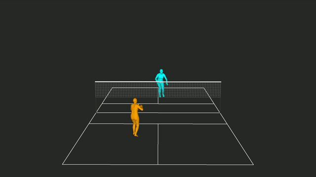
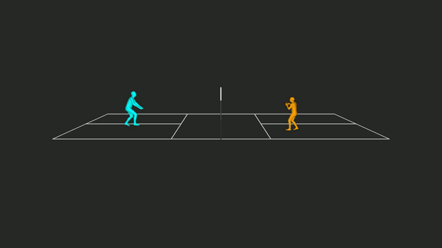
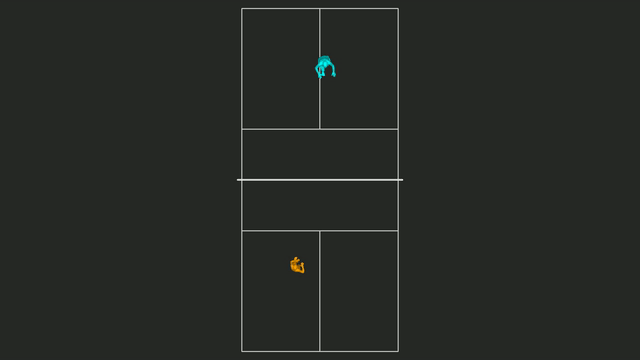

  <h1>🏸 3D Badminton Simulation</h1>
  
<b>Monocular Camera-based 3D Trajectory Extraction & Simulation</b>

 

## 👁️ 3D Simulation Results

단일 카메라(Monocular Camera) 영상을 기반으로 선수와 셔틀콕의 3D 궤적을 추출하여, 세 가지 시점(Side, Front, Top)에서 3D 시뮬레이션으로 복원한 결과입니다.

<table align="center">
  <tr>
    <td align="center"><b>Front View</b></td>
    <td align="center"><b>Side View</b></td>
    <td align="center"><b>Top View</b></td>
  </tr>
  <tr>
    <td width="33%">
      
    </td>
    <td width="33%">
      
    </td>
    <td width="33%">
      
    </td>
  </tr>
</table>

 

## 🚀 Project Overview

* **Objective:** 2D 배드민턴 경기 영상에서 3D 공간 정보를 복원하여 선수들의 움직임과 셔틀콕의 궤적을 분석합니다.
* **Key Features:**
  * 단일 카메라 환경의 한계를 극복하기 위한 Camera Calibration 및 Pose Estimation 적용
  * 2D 좌표를 3D 공간으로 투영(Projection)하여 시뮬레이션 환경 구축

## 🛠️ Tech Stack
* `Python`, `OpenCV`, `Pose Estimation Models`, `3D Visualization`
